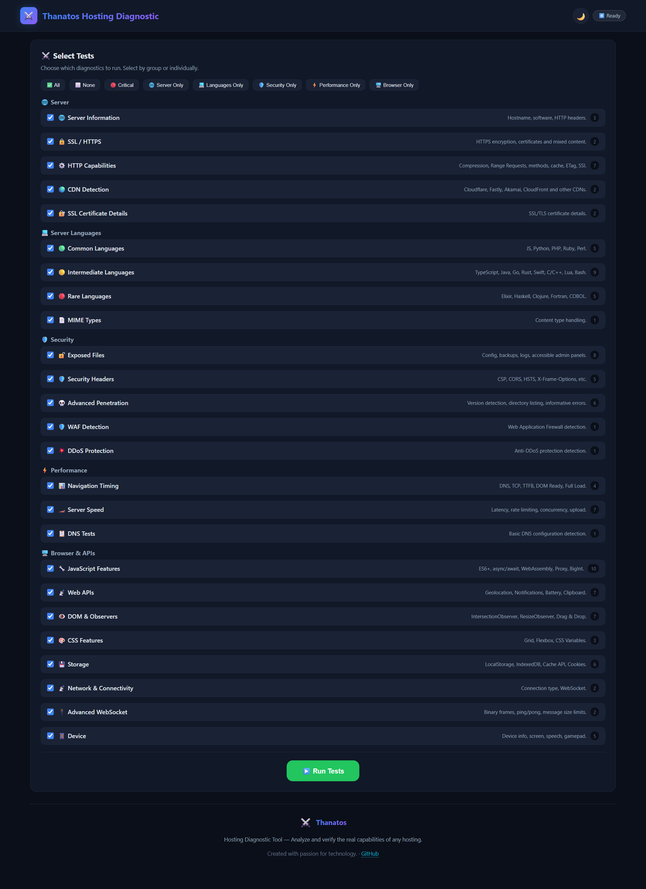
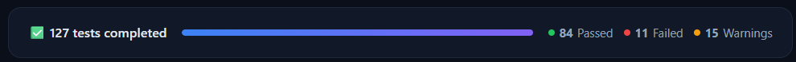
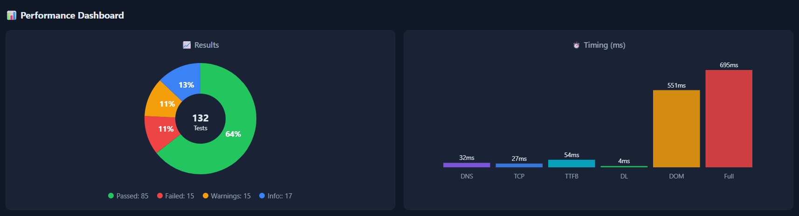
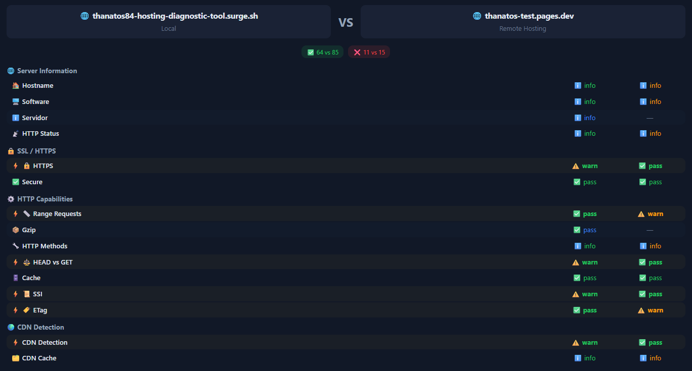
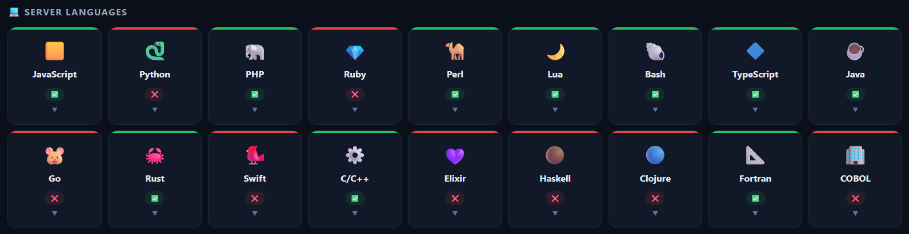
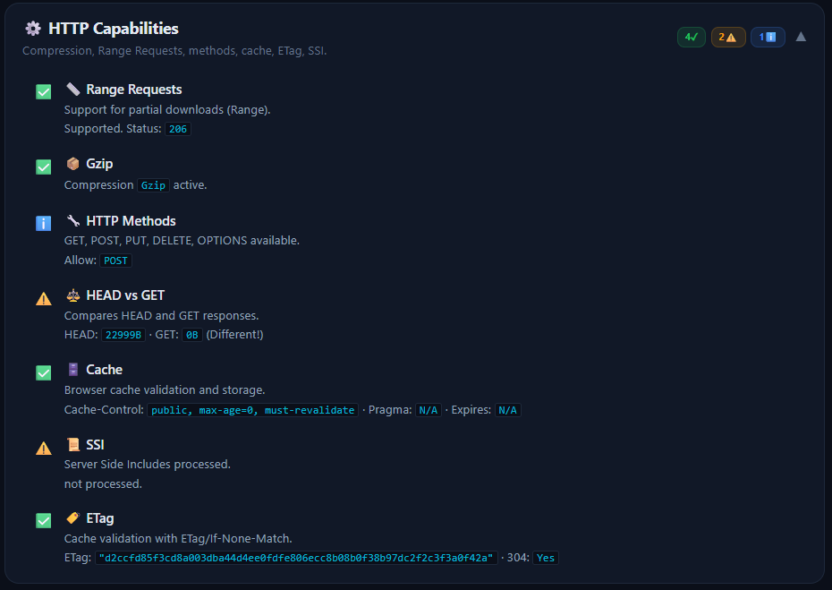

<div align="center">

# ⚔️ Thanatos Hosting Diagnostic Tool

**¿Tu hosting es realmente lo que promete?**  
*Descubre capacidades ocultas, vulnerabilidades de seguridad y el rendimiento real de cualquier servidor.*

[](LICENSE)
[]()
[]()
[]()

<br>

[🚀 Surge.sh Demo](http://thanatos84-hosting-diagnostic-tool.surge.sh/) &nbsp;·&nbsp;
[☁️ Cloudflare Demo](http://thanatos84-hosting-diagnostic-tool.pages.dev/) &nbsp;·&nbsp;
[📖 Tutorial HTML](https://thanatos84-hosting-diagnostic-tool.pages.dev/walkthrough) &nbsp;·&nbsp;
[🐛 Reportar bug](https://github.com/thanatos84/hosting-diagnostic-tool/issues)

</div>

---

## 🎯 ¿Para qué sirve Thanatos Hosting Diagnostic Tool?

**Los hostings mienten (por omisión).**

Cuando contratas un hosting, el proveedor te dice lo mínimo: "soporta PHP y MySQL". Pero no te cuenta que también ejecuta Python, que tiene Brotli activado, que permite WebSockets o que acepta subida de archivos por PUT. ¿Por qué no lo dicen? Porque **no les interesa que aproveches todos los recursos**.

**Thanatos Hosting Diagnostic Tool lo descubre todo por ti.** Subes la herramienta a cualquier hosting, pulsas un botón, y obtienes un informe completo de TODO lo que ese servidor puede hacer realmente.

### 🕵️ Lo que puedes descubrir

| Qué busca | Por qué importa |
|-----------|----------------|
| **Lenguajes ocultos** | ¿Tu hosting "solo PHP" ejecuta Python, Ruby o Perl sin que lo sepas? |
| **Capacidades desaprovechadas** | Compresión Brotli, HTTP/2, WebSockets, CDN... cosas que ya pagas pero quizás no estás usando |
| **Puertas traseras de seguridad** | Archivos .env expuestos, .git accesible, backups olvidados, logs abiertos |
| **Rendimiento real** | Latencia, concurrencia, tiempos de carga. No lo que prometen, sino lo que miden |

### 💡 Caso real: Surge.sh

Surge.sh se anuncia como "hosting estático — solo HTML, CSS y JavaScript". Pero al pasarle **Thanatos Hosting Diagnostic Tool**, descubrimos que también ejecuta PHP, Python, Ruby y Perl. Funcionalidades que **están ahí, funcionando, y nadie te dice que existen**. Eso es información que vale dinero: puedes alojar aplicaciones dinámicas en un servicio que pagas como estático.

---

## ✨ Características principales

### 🔬 Más de 80 tests de diagnóstico

| Categoría | Tests | ¿Qué detecta? |
|-----------|-------|---------------|
| 🌐 **Servidor** | 16 | Software (Nginx, Apache, IIS), SSL, compresión (Brotli/Gzip), HTTP/2, CDN (Cloudflare, Fastly, Akamai), SSI, caché |
| 💻 **Lenguajes** | 19 | JavaScript, Python, PHP, Ruby, Perl, TypeScript, Java, Go, Rust, Swift, C/C++, Lua, Bash, Elixir, Haskell, Clojure, Fortran, COBOL |
| 🛡️ **Seguridad** | 21 | Archivos .env/.git expuestos, backups, logs, CSP, HSTS, CORS, clickjacking, WAF, directory listing |
| ⚡ **Rendimiento** | 12 | Navigation Timing (DNS/TCP/TTFB), latencia, rate limiting, concurrencia, uploads POST/PUT |
| 🖥️ **Navegador** | 30+ | ES6+, WebGL, Service Workers, WebSocket, IndexedDB, CSS Grid/Flexbox, WebAssembly, Web Share |

### 🎨 Interfaz de usuario

- **Selector de idioma** — 7 idiomas (ES, EN, PT, FR, DE, JA, ZH)
- **Panel de selección** — Elige tests por grupo o individualmente
- **Filtros rápidos** — Todos, Ninguno, Críticos, Solo Lenguajes, Solo Seguridad, Solo Rendimiento, Solo Navegador
- **Barra de progreso** — Avance en tiempo real con estadísticas en vivo
- **Tiles de lenguajes** — Vista rápida del estado (🟢/🔴/🟡) con detalles expandibles
- **Acordeones** — Resultados agrupados con badges de conteo
- **Dashboard visual** — Gráfico donut de resultados + barras de timing
- **Comparador** — Compara dos hostings lado a lado con diferencias resaltadas
- **4 formatos de exportación** — JSON, TXT, Copiar portapapeles, PDF
- **Modo claro/oscuro** — Tema adaptable con persistencia
- **Responsive** — Funciona en desktop, tablet y móvil
- **Notificaciones toast** — Feedback visual inmediato

---

## 📸 Capturas de pantalla

<div align="center">
<table>
<tr>
<td width="50%">
  
  <sub><b>Panel de selección</b> — Todos los tests organizados por categorías</sub>
</td>
<td width="50%">
  
  <sub><b>Ejecución en vivo</b> — Barra de progreso y estadísticas</sub>
</td>
</tr>
<tr>
<td width="50%">
  
  <sub><b>Dashboard</b> — Gráfico donut y barras de timing</sub>
</td>
<td width="50%">
  
  <sub><b>Comparador</b> — Dos hostings lado a lado</sub>
</td>
</tr>
<tr>
<td width="50%">
  
  <sub><b>Tiles de lenguajes</b> — Estado visual de cada lenguaje</sub>
</td>
<td width="50%">
  
  <sub><b>Resultados</b> — Acordeones con badges de conteo</sub>
</td>
</tr>
</table>
</div>

> 📸 **Galería completa** con las 26 capturas disponibles en la carpeta [`assets/`](assets/).

---

## 🚀 Inicio rápido

### Opción 1: Probar online

Elige la plataforma que prefieras:

| Plataforma | Demo principal | Tutorial HTML |
|------------|---------------|---------------|
| 🚀 **Surge.sh** | [thanatos84-hosting-diagnostic-tool.surge.sh](http://thanatos84-hosting-diagnostic-tool.surge.sh/) | [walkthrough.html](https://thanatos84-hosting-diagnostic-tool.pages.dev/walkthrough) |
| ☁️ **Cloudflare Pages** | [thanatos84-hosting-diagnostic-tool.pages.dev](http://thanatos84-hosting-diagnostic-tool.pages.dev/) | [walkthrough.html](http://thanatos84-hosting-diagnostic-tool.pages.dev/walkthrough.html) |

### Opción 2: Subir a tu hosting

```bash
git clone https://github.com/thanatos84/hosting-diagnostic-tool.git
cd hosting-diagnostic-tool

# Sube TODO a la raíz de tu hosting (public_html/ o www/)
# usando FTP/SFTP o el gestor de archivos

# Abre https://tu-dominio.com en tu navegador
```

### Opción 3: Probar localmente

```bash
git clone https://github.com/thanatos84/hosting-diagnostic-tool.git
cd hosting-diagnostic-tool

python -m http.server 8000
# o: npx serve .
# o: php -S localhost:8000

# Abre http://localhost:8000
```

> ⚠️ **Importante:** Algunos tests requieren un servidor HTTP. No funcionan correctamente con `file://`.

---

## 📋 Tests en detalle

### 🌐 Servidor

| Test | Qué detecta |
|------|-------------|
| Hostname & Software | Nginx, Apache, IIS, Cloudflare, etc. |
| SSL/HTTPS | Cifrado activo, contenido mixto |
| Compresión | Brotli, Gzip, Deflate |
| Range Requests | Soporte para descargas parciales |
| HTTP Methods | GET, POST, PUT, DELETE, OPTIONS |
| Cache Headers | Cache-Control, ETag, Pragma |
| SSI | Server Side Includes |
| HTTP/2+ | Protocolo HTTP/2 o HTTP/3 |
| CDN | Cloudflare, Fastly, Akamai, Varnish |
| TLS | Versión TLS, HSTS, handshake |

### 💻 Lenguajes de servidor

| Nivel | Lenguajes |
|-------|-----------|
| 🟢 **Comunes** | JavaScript, Python, PHP, Ruby, Perl |
| 🟡 **Intermedios** | TypeScript, Java, Go, Rust, Swift, C/C++, Lua, Bash, Node.js |
| 🔴 **Raros** | Elixir, Haskell, Clojure, Fortran, COBOL |

### 🛡️ Seguridad

| Test | Qué detecta | Riesgo |
|------|-------------|--------|
| Archivos .env | Credenciales expuestas | 🔴 Crítico |
| Repositorios .git | Código fuente accesible | 🔴 Crítico |
| Backup Files | Bases de datos expuestas | 🔴 Crítico |
| Logs Expuestos | Información interna del servidor | 🟡 Alto |
| CSP | Content-Security-Policy | 🟡 Alto |
| HSTS | Strict-Transport-Security | 🟡 Alto |
| CORS | Access-Control-Allow-Origin | 🟡 Medio |
| Clickjacking | X-Frame-Options | 🟡 Medio |
| Directory Listing | Directorios abiertos | 🟡 Medio |

### ⚡ Rendimiento

| Test | Qué mide |
|------|----------|
| Navigation Timing | DNS, TCP, TTFB, DOM Ready, Full Load |
| Latencia | Tiempo de respuesta del servidor |
| Rate Limiting | Límite de peticiones (429) |
| Concurrencia | 10 requests simultáneas |
| Upload POST/PUT | Subida de archivos |
| POST 100KB | Envío de datos grandes |

### 🖥️ Navegador & APIs

| Categoría | Tests |
|-----------|-------|
| JS Features | ES6+, Arrow, async/await, Promise, WASM, BigInt, Proxy, Map/Set, Web Worker, ES Modules |
| Web APIs | WebGL, Geolocation, Notifications, Clipboard, Battery, Media, Canvas 2D |
| DOM & Observers | IntersectionObserver, ResizeObserver, PerformanceObserver, Drag&Drop, File API |
| CSS Features | Grid, Flexbox, CSS Variables |
| Almacenamiento | LocalStorage, SessionStorage, IndexedDB, Cache API, Cookies, Service Worker |
| Red | Connection API, WebSocket |

---

## 🛠️ Tecnologías

- **Frontend:** HTML5, CSS3 (variables CSS, Grid, Flexbox), Vanilla JavaScript (ES6+)
- **Tests server-side:** Scripts en 18+ lenguajes de programación (Python, PHP, Ruby, etc.)
- **Librerías externas (CDN):** html2canvas + jsPDF (para exportación PDF)
- **Sin build tools:** No necesita npm, webpack, ni compilación
- **Zero dependencias:** Todo funciona directamente al subir los archivos

---

## 📁 Estructura del proyecto

```
hosting-diagnostic-tool/
├── index.html              ← Página principal (UI + lógica + estilos)
├── app.min.js              ← JavaScript minificado
├── app.js                  ← Código fuente JavaScript
├── walkthrough.html        ← Tutorial en HTML
├── WALKTHROUGH.md          ← Tutorial paso a paso (Markdown)
├── README.md               ← Este archivo
├── PROJECT_INFO.md         ← Información técnica del proyecto
├── LICENSE                 ← Licencia MIT
├── robots.txt              ← Configuración para crawlers
├── og-image.png            ← Preview para redes sociales
│
├── assets/                 ← Capturas para el tutorial
│   └── ... (26 capturas)
│
├── lang/                   ← Traducciones (7 idiomas)
│   ├── es.js, en.js, pt.js, fr.js
│   ├── de.js, ja.js, zh.js
│   └── ...
│
├── tests/                  ← Scripts de test por lenguaje
│   ├── js/test.js          ← JavaScript
│   ├── python/test.py      ← Python CGI
│   ├── php/test.php        ← PHP
│   ├── ... (18 lenguajes)
│   └── worker/worker.js    ← Web Worker
│
└── probes/                 ← Archivos de prueba HTTP
    ├── .htaccess
    ├── test.ssi
    └── test_upload.txt
```

---

## 📊 Comparar hostings

Una de las funcionalidades estrella: comparar dos hostings lado a lado.

1. **Ejecuta tests en Hosting A** → exporta JSON
2. **Ejecuta tests en Hosting B**
3. En Hosting B, pega el JSON del Hosting A en el comparador
4. Haz clic en **📊 Comparar**
5. Ve las diferencias con diferencias resaltadas

---

## 📄 Licencia

Este proyecto está bajo la licencia MIT — ver el archivo [LICENSE](LICENSE) para más detalles.

---

## 🤝 Contribuir

¡Las contribuciones son bienvenidas!

1. Haz [fork](https://github.com/thanatos84/hosting-diagnostic-tool/fork) del repositorio
2. Crea una branch (`git checkout -b feature/nueva-feature`)
3. Haz commit (`git commit -m 'Añadir nueva feature'`)
4. Push (`git push origin feature/nueva-feature`)
5. Abre un [Pull Request](https://github.com/thanatos84/hosting-diagnostic-tool/pulls)

### Ideas para contribuir

- Añadir tests para más lenguajes
- Mejorar la detección de CDNs
- Nuevos tests de seguridad
- Traducciones a más idiomas
- Mejoras en la UI/UX

---

## 📖 Documentación

| Recurso | Descripción |
|---------|-------------|
| [📖 WALKTHROUGH.md](WALKTHROUGH.md) | Tutorial paso a paso (Markdown) |
| [🖥️ walkthrough.html](https://thanatos84-hosting-diagnostic-tool.pages.dev/walkthrough) | Tutorial completo en HTML |
| [📋 PROJECT_INFO.md](PROJECT_INFO.md) | Información técnica del proyecto |

---

<div align="center">
  
**⚔️ Thanatos Hosting Diagnostic Tool** — *Creado con pasión por la tecnología*

*No contrates un hosting mejor. Averigua si el que ya tienes es mejor de lo que crees.*

[](https://github.com/thanatos84/hosting-diagnostic-tool/stargazers)
[](https://github.com/thanatos84/hosting-diagnostic-tool/network/members)

</div>
