# ⚔️ Thanatos Hosting Diagnostic Tool — Tutorial Completo

> **Descubre todo lo que tu hosting puede (y no puede) hacer.**

---

## 📋 Índice

1. [¿Qué es Thanatos Hosting Diagnostic Tool?](#-qué-es-thanatos-hosting-diagnostic-tool)
2. [Requisitos](#-requisitos)
3. [Instalación y despliegue](#-instalación-y-despliegue)
4. [Paso 1: Seleccionar idioma](#-paso-1-seleccionar-idioma)
5. [Paso 2: Panel de selección de tests](#-paso-2-panel-de-selección-de-tests)
6. [Paso 3: Filtrar tests rápidamente](#-paso-3-filtrar-tests-rápidamente)
7. [Paso 4: Selección granular por grupo](#-paso-4-selección-granular-por-grupo)
8. [Paso 5: Ejecutar tests](#-paso-5-ejecutar-tests)
9. [Paso 6: Resultados en acordeones](#-paso-6-resultados-en-acordeones)
10. [Paso 7: Información del servidor](#-paso-7-información-del-servidor)
11. [Paso 8: Tiles de lenguajes](#-paso-8-tiles-de-lenguajes)
12. [Paso 9: Dashboard y gráficos](#-paso-9-dashboard-y-gráficos)
13. [Paso 10: Exportar resultados](#-paso-10-exportar-resultados)
14. [Paso 11: Comparar hostings](#-paso-11-comparar-hostings)
15. [Paso 12: Footer y GitHub](#-paso-12-footer-y-github)
16. [Modo claro / oscuro](#-modo-claro--oscuro)
17. [Notificaciones toast](#-notificaciones-toast)
18. [Diseño responsive](#-diseño-responsive)
19. [Compatibilidad con redes sociales](#-compatibilidad-con-redes-sociales)
20. [Solución de problemas](#-solución-de-problemas)

---

## 🏰 ¿Qué es Thanatos Hosting Diagnostic Tool?

**Thanatos Hosting Diagnostic Tool** es una herramienta web auto-contenida que analiza y comprueba las capacidades reales de cualquier hosting. No necesita instalación, frameworks, ni dependencias — solo subes los archivos a un servidor y ejecutas los tests desde el navegador.

### ¿Qué puede detectar?

| Categoría | Tests |
|-----------|-------|
| 🌐 **Servidor** | Software (Nginx, Apache, IIS), SSL, compresión, HTTP/2, SSI, CDN, caché |
| 💻 **Lenguajes (18)** | JavaScript, Python, PHP, Ruby, Perl, Go, Rust, Java, TypeScript, Swift, C/C++, Lua, Bash y más |
| 🛡️ **Seguridad** | Archivos .env expuestos, .git accesible, backups, logs, headers CSP/HSTS/CORS, clickjacking |
| ⚡ **Rendimiento** | Timing DNS/TCP/TTFB, latencia, rate limiting, concurrencia, uploads |
| 🖥️ **Navegador** | ES6+, WebGL, Service Workers, WebSocket, IndexedDB, CSS Grid/Flexbox, WebAssembly |

---

## 📋 Requisitos

- Un **navegador web moderno** (Chrome 80+, Firefox 75+, Safari 13+, Edge 80+)
- Un **hosting con acceso FTP/SFTP** (para usar en producción)
- O un **servidor local** (para pruebas: Python, Node.js o PHP)

---

## 🔧 Instalación y despliegue

### Opción 1: Probar online (demo en vivo)

Puedes probar la herramienta sin instalar nada en cualquiera de estos enlaces:

| Plataforma | URL Demo | URL Tutorial |
|------------|----------|--------------|
| 🚀 **Surge.sh** | [thanatos84-hosting-diagnostic-tool.surge.sh](http://thanatos84-hosting-diagnostic-tool.surge.sh/) | [walkthrough.html](http://thanatos84-hosting-diagnostic-tool.surge.sh/walkthrough.html) |
| ☁️ **Cloudflare Pages** | [thanatos84-hosting-diagnostic-tool.pages.dev](http://thanatos84-hosting-diagnostic-tool.pages.dev/) | [walkthrough.html](http://thanatos84-hosting-diagnostic-tool.pages.dev/walkthrough.html) |

### Opción 2: Subir a un hosting (recomendado)

1. Descarga el proyecto desde [GitHub](https://github.com/thanatos84/hosting-diagnostic-tool)
2. Sube **todos** los archivos y carpetas a la raíz de tu hosting (`public_html/` o `www/`)
3. Accede a `https://tu-dominio.com` desde tu navegador

### Opción 3: Probar localmente

```bash
# Clona el repositorio
git clone https://github.com/thanatos84/hosting-diagnostic-tool.git
cd hosting-diagnostic-tool

# Opción A — Python
python -m http.server 8000

# Opción B — Node.js
npx serve .

# Opción C — PHP
php -S localhost:8000
```

Abre `http://localhost:8000` en tu navegador.

> ⚠️ **Importante:** Algunos tests de servidor no funcionan con `file://` por CORS. Usa siempre un servidor HTTP local.

---

## 🌐 Paso 1: Seleccionar idioma

Al abrir la web por primera vez, aparece el selector de idioma obligatorio. Thanatos Hosting Diagnostic Tool soporta **7 idiomas**: Español, Inglés, Portugués, Francés, Alemán, Japonés y Chino.

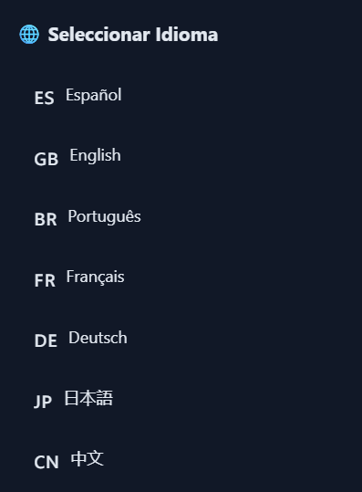

Simplemente haz clic en el idioma que prefieras. Una vez seleccionado, la interfaz se desbloqueará completamente. Puedes cambiar de idioma en cualquier momento desde el botón 🌐️ en el header.

---

## 🎯 Paso 2: Panel de selección de tests

Después de elegir el idioma, verás el panel principal con todos los tests organizados por categorías.


El panel de selección muestra **5 categorías principales**, cada una con sus subgrupos:

| Categoría | Subgrupos |
|-----------|-----------|
| 🌐 **Servidor** | Información del Servidor (3), SSL/HTTPS (2), Capacidades HTTP (7), CDN (2), SSL Avanzado (2) |
| 💻 **Lenguajes** | Comunes (5), Intermedios (9), Raros (5), Tipos MIME (1) |
| 🛡️ **Seguridad** | Archivos Expuestos (8), Headers (5), Penetración (6), WAF (1), DDoS (1) |
| ⚡ **Rendimiento** | Timing (4), Velocidad (7), DNS (1) |
| 🖥️ **Navegador** | JS Features (10), Web APIs (7), DOM (7), CSS (3), Storage (6), Red (2), WebSocket Adv (2), Dispositivo (5) |

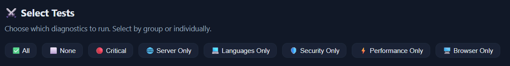

Cada subgrupo muestra:
- **Nombre e icono** del grupo
- **Descripción** de lo que incluye
- **Número de tests** entre paréntesis
- **Checkbox** para marcar/desmarcar todo el grupo

---

## ⚡ Paso 3: Filtrar tests rápidamente

En la parte superior del panel hay botones de filtros rápidos para seleccionar grupos de tests al instante:

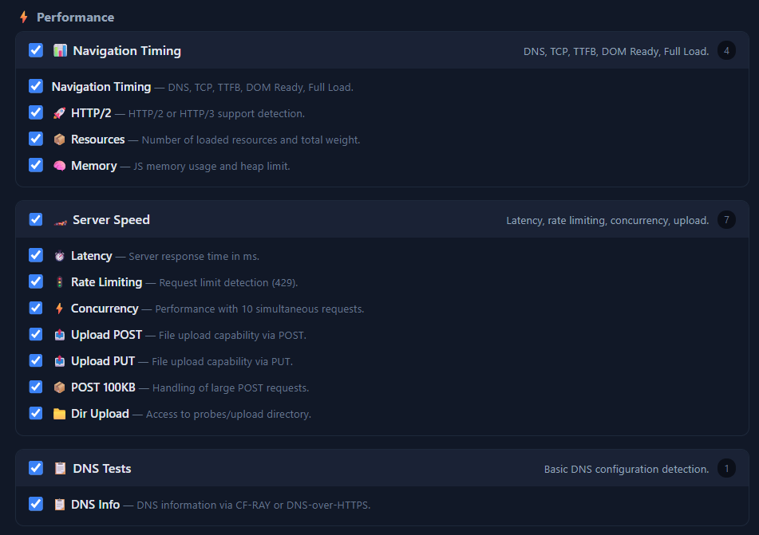

| Botón | Selecciona |
|-------|------------|
| ✅ **Todos** | Todos los tests disponibles (~80) |
| ⬜ **Ninguno** | Desmarca todo |
| 🔴 **Críticos** | Servidor, SSL, Archivos Expuestos, Headers, Penetración |
| 🌐 **Solo Servidor** | Solo tests de servidor |
| 💻 **Solo Lenguajes** | Solo tests de lenguajes de programación |
| 🛡️ **Solo Seguridad** | Solo tests de seguridad |
| ⚡ **Solo Rendimiento** | Solo tests de rendimiento |
| 🖥️ **Solo Navegador** | Solo tests del navegador |

---

## 🔍 Paso 4: Selección granular por grupo

Puedes expandir cada grupo con un clic para marcar o desmarcar tests individuales.


Esto te permite crear una selección personalizada — por ejemplo, probar solo Python, PHP y Ruby sin tener que ejecutar todos los lenguajes.

Cuando tengas tu selección lista, haz clic en el botón **▶ Ejecutar Tests**.

---

## 🚀 Paso 5: Ejecutar tests

Al hacer clic en **▶ Ejecutar Tests**:

1. El panel de selección se oculta
2. Aparece la **barra de progreso** con el avance en tiempo real
3. Los **tiles de lenguajes** comienzan a iluminarse
4. Los **acordeones de resultados** se llenan dinámicamente


Durante la ejecución puedes ver:
- **Barra de progreso** con porcentaje completado
- **Estadísticas en vivo**: ✅ Aprobados, ❌ Fallidos, ⚠️ Advertencias
- **Tiles de lenguajes** que cambian de color según se completan
- **Badges** en cada grupo de resultados

---

## 📊 Paso 6: Resultados en acordeones

Cuando los tests finalizan, los resultados se muestran organizados en acordeones expandibles.


Cada acordeón muestra:
- **Icono y nombre** del grupo de tests
- **Badges de conteo**: ✅ 3✓ ❌ 1✗ ⚠️ 0⚠
- **Flecha** para expandir/colapsar

Al expandir un acordeón, ves cada test individual con:

| Icono | Estado | Significado |
|-------|--------|-------------|
| ✅ **Pass** | Verde | La característica está soportada |
| ❌ **Fail** | Rojo | No está soportada o hay un problema |
| ⚠️ **Warn** | Naranja | Parcialmente disponible o con limitaciones |
| ℹ️ **Info** | Azul | Información general (sin juicio) |

Cada test muestra:
- **Nombre del test**
- **Descripción** de qué mide
- **Detalle técnico** con los valores detectados
- **Datos en bruto** (si aplica, expandible)

---

## 🖥️ Paso 7: Información del servidor

Thanatos Hosting Diagnostic Tool detecta automáticamente la información del servidor donde está alojado.

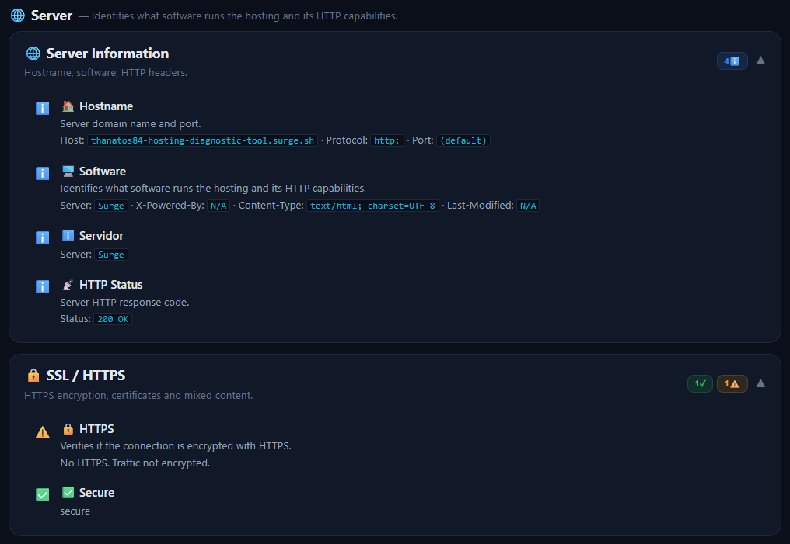

Los datos que se muestran incluyen:
- **Hostname** del servidor
- **Protocolo** (https / http)
- **Puerto** utilizado
- **Software** del servidor (Nginx, Apache, IIS, Cloudflare...)
- **Headers** detectados

Esta información es útil para identificar rápidamente qué tecnología usa tu hosting.

---

## 💻 Paso 8: Tiles de lenguajes

Los tiles de lenguajes ofrecen una vista rápida del estado de cada lenguaje de programación.


Cada tile representa un lenguaje y se colorea según su estado:

| Color | Significado |
|-------|-------------|
| 🟢 **Verde** | El lenguaje está habilitado en el servidor |
| 🔴 **Rojo** | El lenguaje no está disponible |
| 🟡 **Naranja** | Estado mixto o parcial |
| ⏳ **Gris** | Pendiente de ejecución |

Puedes hacer clic en cualquier tile para expandirlo y ver los detalles completos de ese lenguaje.

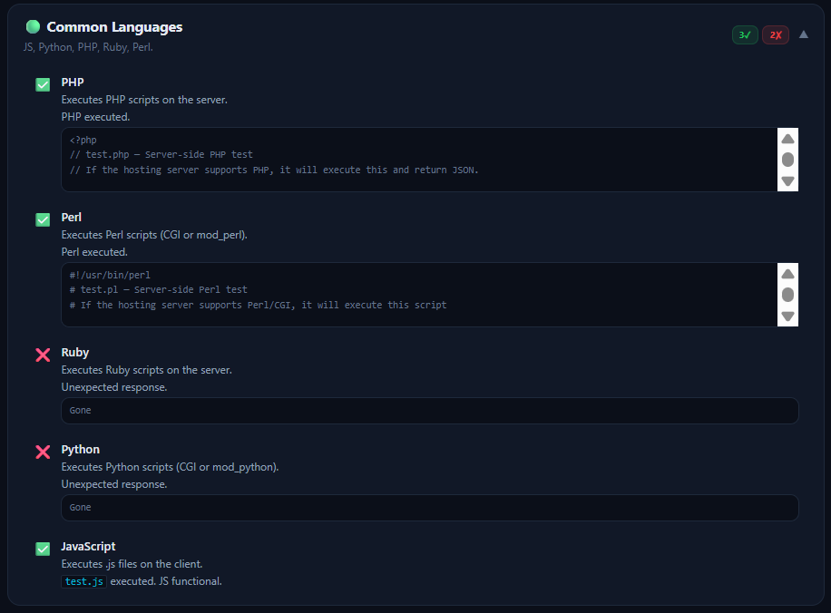

Los lenguajes detectados incluyen: JavaScript, Python, PHP, Ruby, Perl, TypeScript, Java, Go, Rust, Swift, C/C++, Lua, Bash, Elixir, Haskell, Clojure, Fortran y COBOL.

---

## 📈 Paso 9: Dashboard y gráficos

Al finalizar los tests, Thanatos Hosting Diagnostic Tool genera un dashboard visual con dos gráficos.


### 🍩 Gráfico de resultados (donut)

Muestra la proporción de tests aprobados, fallidos, advertencias e información. Cada sección incluye el porcentaje sobre el total.

- ✅ **Verde** — Tests aprobados
- ❌ **Rojo** — Tests fallidos
- ⚠️ **Naranja** — Advertencias
- ℹ️ **Azul** — Información

El centro del donut muestra el número total de tests ejecutados.

### 📊 Gráfico de timing (barras)

Muestra los tiempos de carga medidos por el Navigation Timing API:

| Métrica | Descripción |
|---------|-------------|
| **DNS** | Tiempo de resolución DNS |
| **TCP** | Tiempo de conexión TCP |
| **TTFB** | Time To First Byte |
| **DL** | Tiempo de descarga |
| **DOM** | DOM Content Loaded |
| **Full** | Tiempo de carga completo |

---

## 📥 Paso 10: Exportar resultados

Thanatos Hosting Diagnostic Tool ofrece **4 formatos de exportación** para guardar o compartir los resultados.

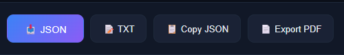

| Botón | Formato | Cuándo usarlo |
|-------|---------|---------------|
| 📥 **JSON** | Structured data (.json) | Para comparar hostings o procesamiento programático |
| 📝 **TXT** | Texto plano (.txt) | Para leer, compartir por email o incrustar en informes |
| 📋 **Copiar** | JSON al portapapeles | Para pegar rápidamente en el comparador |
| 📄 **PDF** | Documento PDF | Para guardar, imprimir o enviar como documento formal |

> **Consejo:** Exporta en JSON después de ejecutar tests en cada hosting. Luego puedes usar esos JSONs en el comparador para ver diferencias lado a lado.

---

## 🔍 Paso 11: Comparar hostings

Una de las funciones más potentes: comparar dos hostings lado a lado.


### Cómo usarlo:

1. **Ejecuta tests en el Hosting A** → exporta el JSON
2. **Ejecuta tests en el Hosting B**
3. En el Hosting B, pega el JSON del Hosting A en el campo de texto del comparador
4. Haz clic en **📊 Comparar**

### Qué verás:

- **Encabezado** con los nombres de ambos hostings
- **Estadísticas resumidas**: ✅ aprobados vs ❌ fallidos
- **Tests agrupados** por categoría
- **Diferencias resaltadas**: un ⚡️ marca los tests donde los resultados difieren
- **Grid 3 columnas**: Nombre del test | Hosting A | Hosting B
- **Conteo final** de diferencias encontradas

Esto es ideal para decidir entre dos proveedores de hosting o para verificar que una migración no ha perdido capacidades.

---

## 🔗 Paso 12: Footer y GitHub

El footer de la web contiene el enlace al repositorio de GitHub donde se aloja el código fuente.

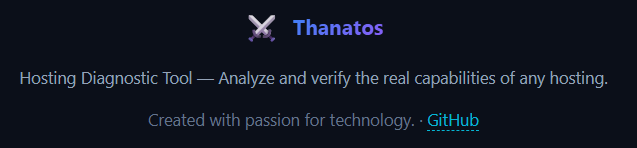

Desde ahí puedes:
- Acceder al código fuente completo
- Reportar issues o sugerir mejoras
- Hacer fork del proyecto
- Ver la documentación adicional

---

## 🌓 Modo claro / oscuro

Thanatos Hosting Diagnostic Tool soporta cambio de tema con un solo clic.

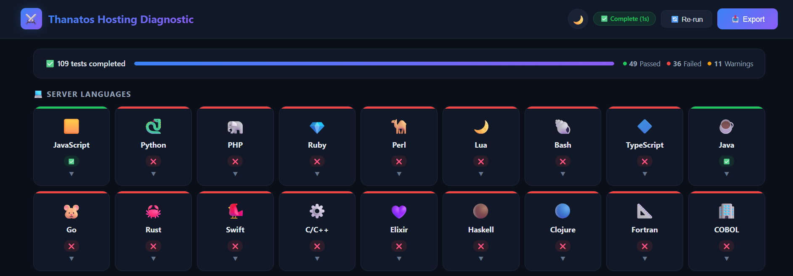
*Modo oscuro (por defecto)*

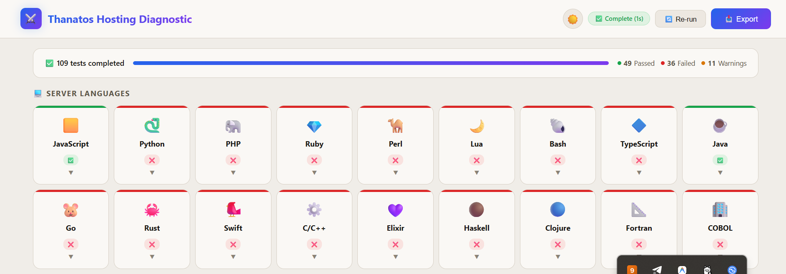
*Modo claro*

Haz clic en el botón 🌙️/☀️ en la esquina superior derecha para alternar entre modos. El tema elegido se guarda automáticamente en tu navegador (LocalStorage) y se recuerda entre sesiones.

Por defecto, Thanatos Hosting Diagnostic Tool respeta la preferencia de tu sistema operativo (`prefers-color-scheme`).

---

## 🔔 Notificaciones toast

Thanatos Hosting Diagnostic Tool usa notificaciones emergentes (toasts) para darte feedback visual inmediato.

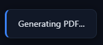

| Tipo | Color | Cuándo aparece |
|------|-------|----------------|
| ✅ **Éxito** | Verde borde | Exportación completa, copia al portapapeles |
| ❌ **Error** | Rojo borde | Fallo al exportar, error de JSON inválido |
| ⚠️ **Advertencia** | Naranja borde | No hay tests seleccionados |
| ℹ️ **Info** | Azul borde | Cambio de idioma, generación de PDF |

Los toasts aparecen en la esquina inferior derecha y desaparecen automáticamente a los 3 segundos.

---

## 📱 Diseño responsive

Thanatos Hosting Diagnostic Tool está diseñado para funcionar en cualquier dispositivo.


| Dispositivo | Comportamiento |
|-------------|----------------|
| 💻 **Desktop** | Layout completo con grid de 4-5 columnas en tiles |
| 📱 **Tablet** | Adaptación a 3 columnas, menú colapsado |
| 📱 **Móvil** | Layout de 2 columnas, optimizado para pantallas pequeñas |

Los acordeones, tabs y botones se adaptan perfectamente al tacto, haciendo la herramienta utilizable desde cualquier navegador móvil.

---

## 🃏 Compatibilidad con redes sociales

Thanatos Hosting Diagnostic Tool incluye meta tags Open Graph y Twitter Cards optimizados.

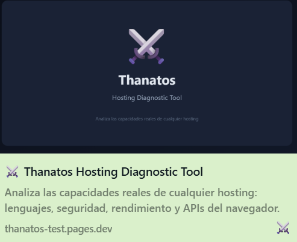

Cuando compartes un enlace a la herramienta en redes sociales, se muestra:
- **Título**: ⚔️ Thanatos Hosting Diagnostic Tool
- **Descripción**: Analiza las capacidades reales de cualquier hosting
- **Imagen**: Preview personalizada con la marca Thanatos

Esto funciona en Facebook, Twitter/X, WhatsApp, Telegram, LinkedIn y Discord.

---

## 🔧 Solución de problemas

### Los tests de Python/PHP no funcionan

- Verifica que tu hosting soporta CGI
- En hosting compartido, los scripts CGI suelen estar deshabilitados
- Contacta a tu proveedor para habilitar CGI

### La página no carga correctamente

1. Abre la consola del navegador (F12)
2. Busca errores de JavaScript
3. Verifica que `app.min.js` se carga correctamente
4. Asegúrate de que no hay errores CORS

### Los acordeones no muestran contenido

- Verifica que `app.min.js` se carga sin errores
- Comprueba la ruta de los archivos en la consola

### El PDF no se genera

- Verifica que las librerías html2canvas y jsPDF se cargan correctamente (CDN)
- Revisa la consola para errores de CORS
- Prueba exportar en JSON o TXT como alternativa

### Los tests de archivos expuestos muestran falsos positivos

- Algunos servidores devuelven 200 para rutas inexistentes
- Thanatos Hosting Diagnostic Tool verifica el contenido, no solo el código HTTP
- Revisa los detalles de cada test para más información

### No puedo ver resultados de compresión

- La compresión depende del servidor y del navegador
- Asegúrate de que tu hosting tiene habilitada la compresión

---

## 📊 Ejemplo de diagnóstico completo

```
⚔️ THANATOS HOSTING DIAGNOSTIC
example.com — 2026-06-10T12:00:00.000Z

🌐 Información del Servidor
✅ Hostname: example.com · Protocolo: https: · Puerto: (default)
✅ Servidor: nginx · X-Powered-By: N/A
✅ HTTPS: HTTPS activo. Tráfico cifrado.
✅ Compresión: Brotli activa.

💻 Lenguajes
❌ Python: tests/python/test.py devuelto en bruto
✅ PHP: PHP ejecutado correctamente
✅ JavaScript: Ejecutado en navegador

🛡️ Seguridad
✅ Archivos .env: No expuestos
❌ Headers CSP: No detectado
✅ Clickjacking: Protegido (X-Frame-Options)

⚡ Rendimiento
DNS: 12ms · TCP: 25ms · TTFB: 89ms · DOM: 340ms
Latencia: 45ms (Excelente)
```

---

## 📚 Más información

- [Repositorio en GitHub](https://github.com/thanatos84/hosting-diagnostic-tool)
- [PROJECT_INFO.md](PROJECT_INFO.md) — Información técnica del proyecto
- [README.md](README.md) — Descripción general y características

---

*Thanatos Hosting Diagnostic Tool — Creado con pasión por la tecnología* ⚔️
